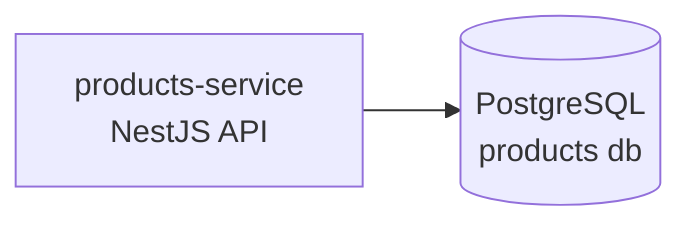

# Arquitetura

## Componentes

| Componente | Tipo | Descrição |
|---|---|---|
| products-service | API (NestJS) | Listagem e busca de produtos |
| PostgreSQL | Banco de dados | Armazena produtos |
