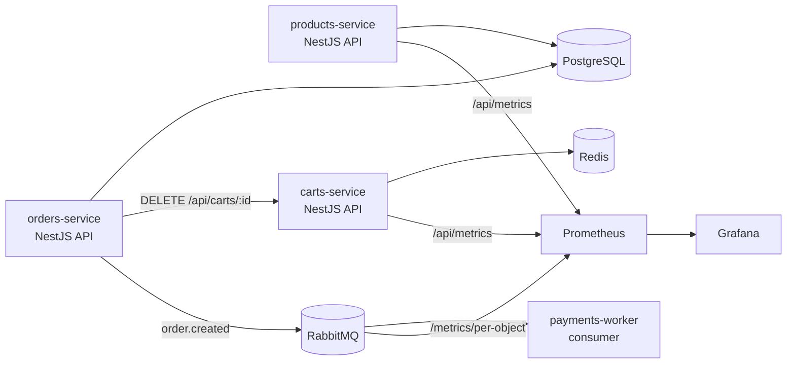

# Arquitetura

## Componentes

| Componente | Tipo | Descrição |
|---|---|---|
| products-service | API (NestJS) | Listagem e busca de produtos |
| carts-service | API (NestJS) | Gerenciamento de carrinhos (Redis), expõe métrica `open_carts` |
| orders-service | API (NestJS) | Criação de pedidos, deleta carrinho via carts-service, publica eventos |
| payments-worker | Consumer (NestJS) | Processa pagamentos da fila |
| PostgreSQL | Banco de dados | Armazena produtos e pedidos |
| Redis | Cache/Store | Armazena carrinhos ativos |
| RabbitMQ | Broker | Fila de mensagens |
| Prometheus | Monitoramento | Coleta métricas das aplicações |
| Grafana | Dashboard | Visualização de métricas |

## Métricas e Autoscaling

| Cenário | Métrica | Ação |
|---|---|---|
| Excesso de chamadas | CPU utilization | HPA escala products-service |
| Fila acumula | `rabbitmq_queue_messages_ready` | KEDA escala payments-worker |
| Demanda alta (SLA) | `open_carts` (carts-service) | HPA escala orders-service proativamente |
