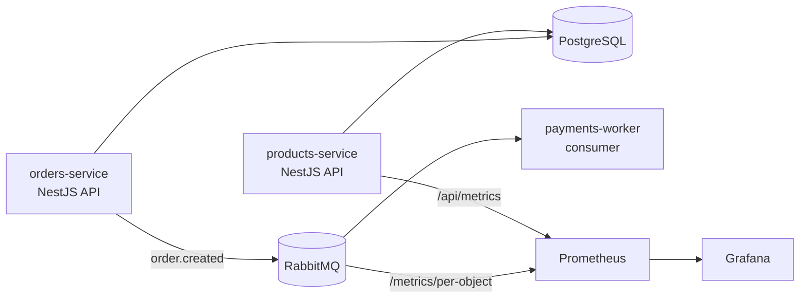

# Arquitetura

## Componentes

| Componente | Tipo | Descrição |
|---|---|---|
| products-service | API (NestJS) | Listagem e busca de produtos |
| orders-service | API (NestJS) | Criação de pedidos, publica eventos |
| payments-worker | Consumer (NestJS) | Processa pagamentos da fila |
| PostgreSQL | Banco de dados | Armazena produtos e pedidos |
| RabbitMQ | Broker | Fila de mensagens |
| Prometheus | Monitoramento | Coleta métricas da API |
| Grafana | Dashboard | Visualização de métricas |
