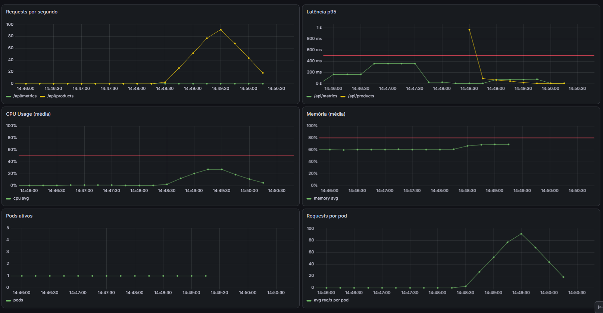
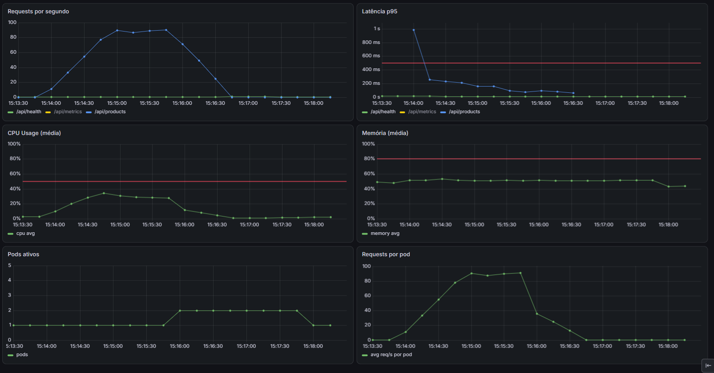

# Cenário 2 — App Trava (Hang)

App trava sem crashar. Container fica "running" mas não responde.

## Load Test

```bash
npm run test:hang
```

Script: `load-tests/hang.js` — 50 VUs por 2min, dispara hang no segundo 60.

## O problema (Docker)

O Docker vê o container como "running" (processo não morreu). Não detecta o problema. A app fica morta-viva indefinidamente.

- Pod/container para de responder (Prometheus não consegue coletar métricas)
- Métricas das rotas param de aparecer (metrics não funcionando)



## Solução (Kubernetes)

livenessProbe detecta que o pod não responde e reinicia automaticamente.

- GET /api/health não responde → livenessProbe falha
- readinessProbe falha → pod sai do Service (para de receber tráfego)
- K8s sobe um novo pod e mata o antigo
- Métricas das rotas continuam sendo recebidas (metrics funcionando)


