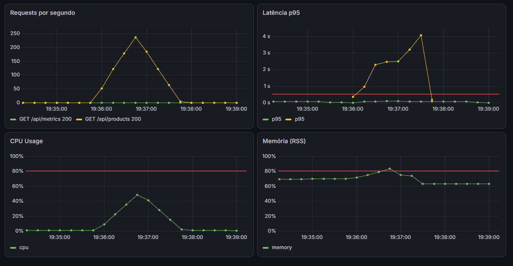

# Cenário 1 — Excesso de Chamadas

App degrada progressivamente sob carga alta. Docker não reage.

## Load Test

```bash
npm run test:high-load
```

Script: `load-tests/high-load.js` — rampa progressiva de VUs.

| Fase | Duração | VUs |
|------|---------|-----|
| Ramp-up | 10s | 0 → 100 |
| Sustentado | 20s | 100 → 300 |
| Pico | 20s | 300 → 500 |
| Cooldown | 10s | 500 → 0 |

## Resultado

| Métrica | Valor |
|---------|-------|
| Requests totais | ~14.400 (~240 req/s) |
| Taxa de sucesso (HTTP) | 100% |
| Latência média | 1.06s |
| Latência p95 | 2.27s |
| Abaixo de 500ms | 34% |
| Acima de 500ms | 66% |

## Dashboard

- Latência muito acima dos 500ms de threshold
- Memória acima do threshold de 80% em um momento



## O problema

O Docker não faz nada. A app degrada e os usuários sofrem até a carga diminuir.

## Solução (Kubernetes)

HPA monitora CPU e escala réplicas automaticamente. Mais pods = mais capacidade = latência estabiliza.
