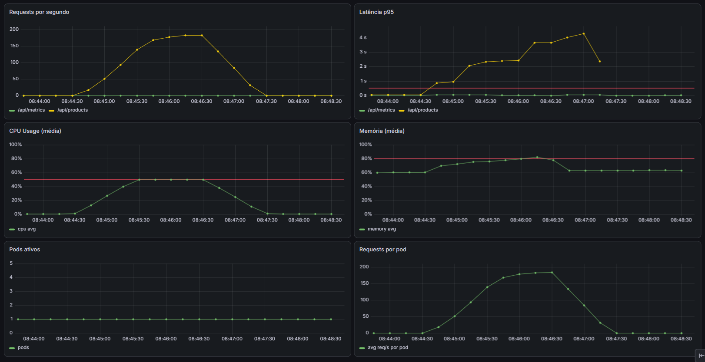
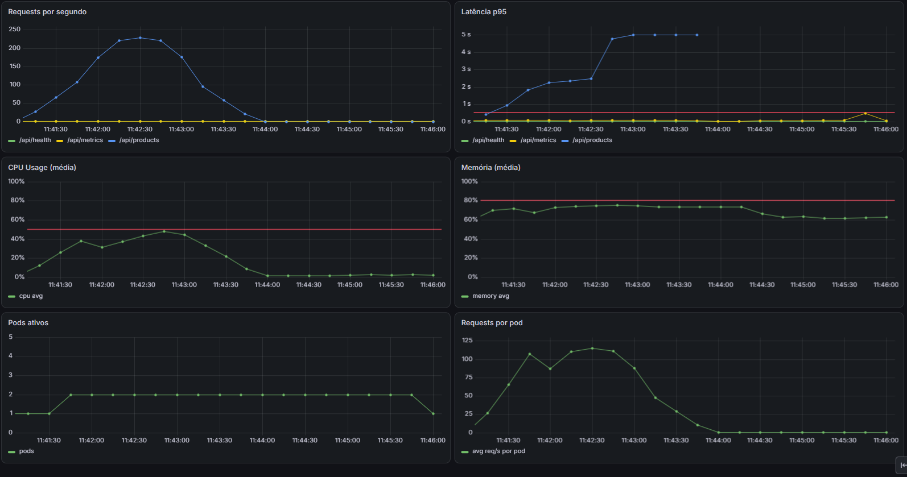

# Cenário 1 — Excesso de Chamadas

App degrada progressivamente sob carga alta. Docker não reage.

## Load Test

```bash
npm run test:high-load
```

Script: `load-tests/high-load.js` — rampa progressiva de VUs.

| Fase | Duração | VUs |
|------|---------|-----|
| Ramp-up | 10s | 0 → 100 |
| Sustentado | 20s | 100 → 300 |
| Pico | 20s | 300 → 500 |
| Cooldown | 10s | 500 → 0 |

## O problema (Docker)

O Docker não faz nada. A app degrada até a carga diminuir.

- CPU chegando ao threshold de 50%



## Solução (Kubernetes)

HPA monitora CPU (threshold 50%) e escala os pods automaticamente.

- CPU chega a 50% → HPA adiciona pods
- Carga de CPU se distribui entre pods → CPU por pod reduz
- Carga cai → após 60s de cooldown, pods extras são removidos


