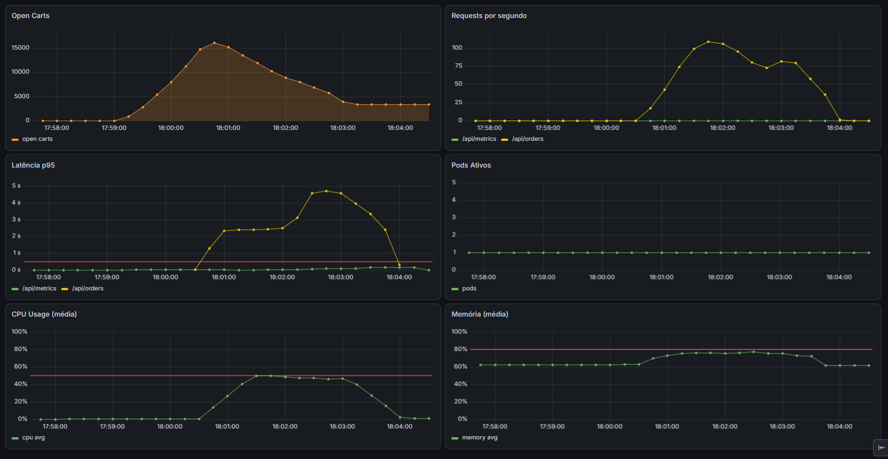

# Cenário 4 — Carrinhos Abertos (Métrica Custom)

Muitos carrinhos abertos indicam pico de compras iminente.

## Load Test

```bash
npm run test:open-carts
```

Simula muitos carrinhos abertos e logo em seguida um pico de orders feitas.

## O problema (Docker)

Carrinhos acumulam, orders degrada. Docker não sabe que a demanda está crescendo.

- Carrinhos abertos passam de 5000
- Aumento de requisições no orders
- Latência, CPU e Memória aumentam acima do threshold



## Solução (Kubernetes)

HPA monitora a métrica `open_carts` do carts-service e escala o orders-service proativamente.

- `open_carts` > 5000 por pod → HPA adiciona pods
- Mais pods = mais capacidade para absorver o checkout
- Carrinhos reduzem → após 60s de cooldown, pods extras são removidos


