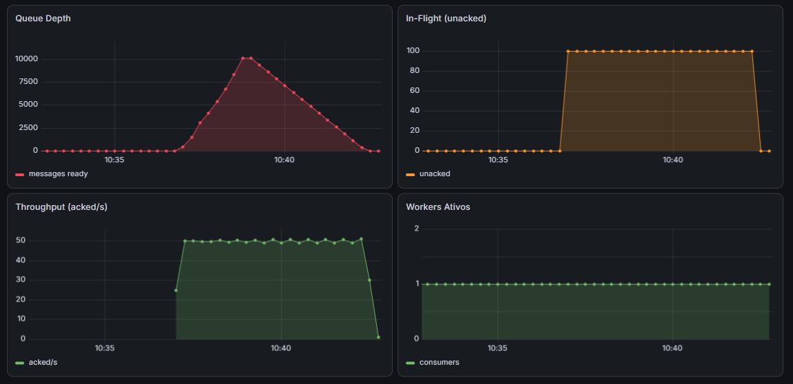
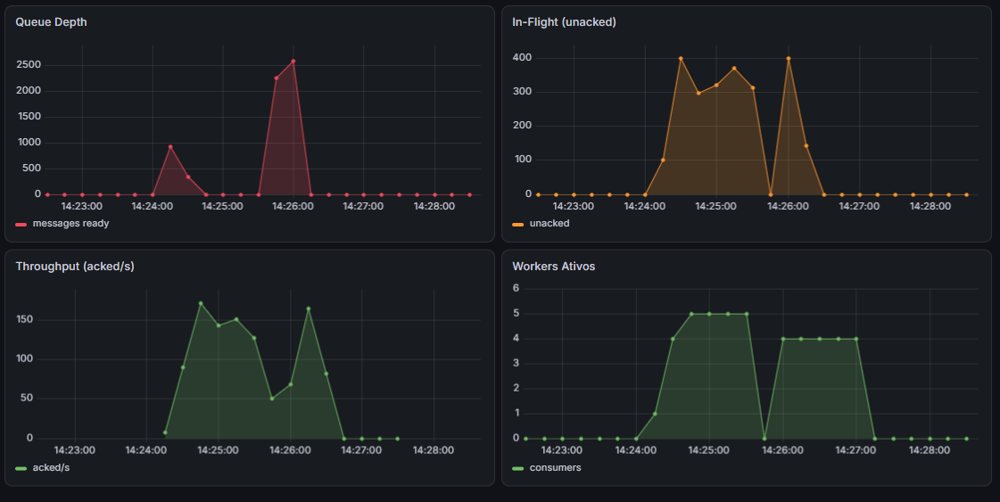

# Cenário 3 — Fila Acumula

Workers não dão conta do volume de mensagens. Docker não escala.

## Load Test

```bash
npm run test:queue
```

## O problema (Docker)

Fila cresce indefinidamente. 1 worker fixo não dá conta. Pedidos atrasam.

- Fila atinge pico de ~10k mensagens
- Fila demora cerca de 5 minutos para ser totalmente consumida
- Worker consome 100 mensagens por vez



## Solução (Kubernetes)

KEDA monitora tamanho da fila e escala payment-worker automaticamente.

- Fila vazia → 0 workers (scale to zero)
- Fila > X mensagens → KEDA adiciona workers
- Fila reduz → KEDA remove workers extras


